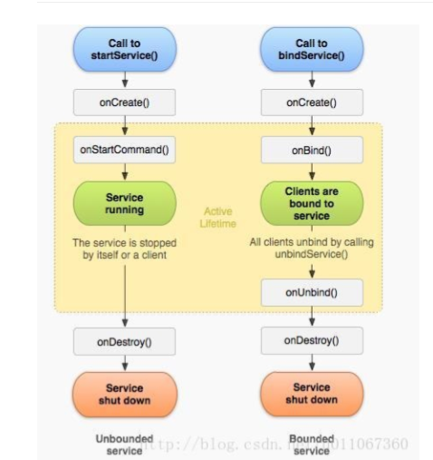

## Service
与Activity同为Context（上下文环境）的子类；
它运行在UI线程中，不能直接使用耗时操作；

#### 种类：
##### 按照运行地点分类；
LocalService本地服务：依附在主进程中；

RemoteService远程服务：独立进程；需要通过AIDL使用IPC通信；

##### 按照运行类型分类：
前台服务：通知栏Notification，对用户有一定的通知作用；

后台服务：不被用户所查知，并完成一系列功能的服务，天气更新，邮件同步等；

##### 按照使用方式分:
startService启动服务，启动一个后台服务，不进行通信，利用stopService停止；
与之相对应的是 使用bindService启动的服务，需要进行通信，bindService停止；

两种启动方式区别从他们的生命周期可以看出：

+ onStartCommand 每次客户端调用startService()方法启动该Service都会回调该方法（多次调用）。一 旦这个方法执行，service就启动并且在后台长期运行。通过调用stopSelf()或 stopService()来停止服务。
+ bindService() 来启动Service的需要进行一个onBind绑定和一个OnUnbind解绑的操作；
+ 第一次绑定完成后，下次再调用bindService方法不会再回调onBind；同时需要返回返回一个IBinder来以使客户端能够使用它与service通 讯，你必须总是实现这个方法，但是如果你不允许绑定，那么你应返回null。

解绑的操作也是只允许使用一次，再次调用会抛出异常；

#####  1.startService	/	stopService 生命周期顺序：onCreate->onStartCommand->onDestroy

注意点： 
①第一次	startService	会触发	onCreate	和	onStartCommand，以后在服务运行过 程中，每次	startService	都只会触发	onStartCommand
 ②不论	startService	多少次，stopService	一次就会停止服务。
##### 2.bindService	/	unbindService生命周期顺序：onCreate->onBind->onUnBind->onDestroy

注意点：
第一次	bindService	会触发	onCreate	和	onBind，以后在服务运行过程中，每次 bindService	都不会触发任何回调

##### 你想要与正在运行的	Service	取得联系，那么有两种方法，一种是使用 broadcast	，另外是使用	bindService	，前者的缺点是如果交流较为频繁，容易造 成性能上的问题，并且	BroadcastReceiver	本身执行代码的时间是很短的（也许执 行到一半，后面的代码便不会执行），而后者则没有这些问题，因此我们肯定选择 使用	bindService（这个时候你便同时在使用	startService	和	bindService	了，这在 Activity	中更新	Service	的某些运行状态是相当有用的